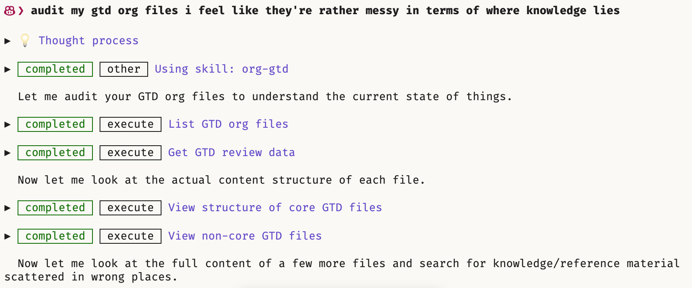
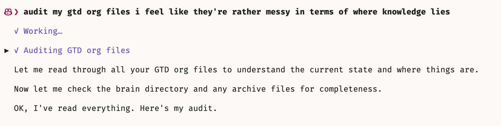

#+title: agent-shell-quiet-mode
#+author: Edd Wilder-James

Compact turn display for [[https://github.com/anthropics/agent-shell][agent-shell]].

When enabled, thought process and tool-call fragments within a turn are
grouped under collapsible sections with a spinner animation, reducing
vertical space.  Each phase of work (a thought followed by tool calls)
gets its own group with a summary label.

This is a pure add-on — it integrates entirely via Emacs advice; no
upstream changes to agent-shell are required.

** Before

(and goes on for 2.5 more screenfuls)

** After

* Installation

** MELPA (planned)

#+begin_src emacs-lisp
(use-package agent-shell-quiet-mode
  :after agent-shell
  :config
  (agent-shell-quiet-mode 1))
#+end_src

** straight.el

#+begin_src emacs-lisp
(use-package agent-shell-quiet-mode
  :straight (:host github :repo "ewilderj/agent-shell-quiet-mode")
  :after agent-shell
  :config
  (agent-shell-quiet-mode 1))
#+end_src

** Manual

Clone this repo and add it to your =load-path=:

#+begin_src emacs-lisp
(add-to-list 'load-path "/path/to/agent-shell-quiet-mode")
(require 'agent-shell-quiet-mode)
(agent-shell-quiet-mode 1)
#+end_src

* Usage

Toggle quiet mode globally:

- =M-x agent-shell-quiet-mode= — toggle on/off
- Click or press =TAB= on a collapsed group to expand its children

* Requirements

- Emacs 29.1+
- [[https://github.com/anthropics/agent-shell][agent-shell]] 0.35.2+

* License

GPL-3.0-or-later
